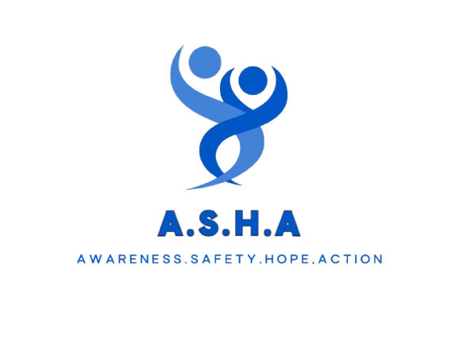

<div align="center">



# 🌍 Project A.S.H.A.

### **Awareness • Safety • Hope • Action**

*A modern, responsive platform dedicated to raising awareness, empowering communities, and driving action against human trafficking.*

<p>
  
  
  
  
  
  
</p>

</div>

---

# 📖 About

**Project A.S.H.A.** is a digital platform built to support the mission of combating **human trafficking** through education, awareness, advocacy, and community engagement.

The website acts as a central hub where visitors can:

- Learn about human trafficking
- Explore Project A.S.H.A.'s initiatives
- Join as volunteers
- Support through donations
- Discover chapters and events
- Access educational resources
- Connect with the team

---

# ✨ Features

- 🏠 Beautiful Landing Page
- 📚 Educational Resources
- 🌍 Chapter Directory
- 👥 Team Showcase
- 🤝 Volunteer Registration
- 💙 Donation Portal
- 🖼️ Photo Gallery
- 📞 Contact & Support
- 🔐 Admin Dashboard
- 📱 Fully Responsive Design
- ⚡ Fast Performance
- 🎨 Modern UI/UX

---

# 🛠 Tech Stack

| Technology | Usage |
|------------|-------|
| **Next.js** | Frontend Framework |
| **React** | UI Components |
| **TypeScript** | Type Safety |
| **Tailwind CSS** | Styling |
| **Supabase** | Backend & Database |
| **Vercel** | Deployment |

---

# 📂 Folder Structure

```text
project-asha/
│
├── app/
├── components/
├── lib/
├── public/
├── assets/
│   └── logo.png
│
├── package.json
├── tsconfig.json
├── README.md
└── ...
```

---

# 🚀 Getting Started

### Clone the repository

```bash
git clone https://github.com/Moksh-dev/project-asha.git
```

### Navigate to the project

```bash
cd project-asha
```

### Install dependencies

```bash
npm install
```

### Configure environment variables

Create a file named `.env.local`

```env
NEXT_PUBLIC_SUPABASE_URL=your_url
NEXT_PUBLIC_SUPABASE_ANON_KEY=your_key
```

### Start the development server

```bash
npm run dev
```

Open:

```
http://localhost:3000
```

---

# 📸 Website Sections

- Home
- About
- Chapters
- Team
- Resources
- Gallery
- Donate
- Contact
- Get Involved
- Admin Dashboard

---

# 🎯 Our Mission

> **"Awareness is the first step toward prevention."**

Project A.S.H.A. believes that education, community participation, and youth leadership can create a world free from human trafficking.

---

# 📈 Future Enhancements

- ✅ CMS Integration
- ✅ Event Management
- ✅ Volunteer Dashboard
- ✅ Chapter Analytics
- ✅ Blog & News
- ✅ Donation Tracking
- ✅ Accessibility Improvements
- ✅ Multi-language Support

---

# 🤝 Contributing

Contributions are always welcome!

```bash
# Fork the repository

# Create a feature branch
git checkout -b feature/new-feature

# Commit your changes
git commit -m "Added awesome feature"

# Push your branch
git push origin feature/new-feature
```

Then open a Pull Request.

---

# 🌐 Deployment

The application is optimized for deployment on **Vercel**.

```bash
git push
```

Every push automatically triggers a new deployment.

---

# 📄 License

This project was developed to support the mission of **Project A.S.H.A.**

Please contact the maintainers before using significant portions of the content for commercial purposes.

---

<div align="center">

## ❤️ Together We Can Create Hope

*"Education inspires action. Awareness saves lives."*

---

### Made with ❤️ by **Moksh Goel**

**Supporting the Mission of Project A.S.H.A.**

⭐ If you found this project inspiring, consider giving it a star!

</div>
